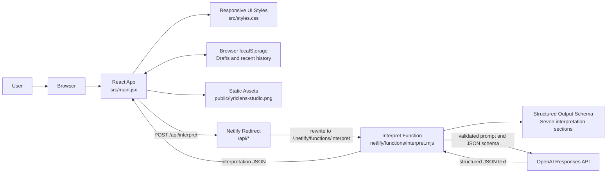
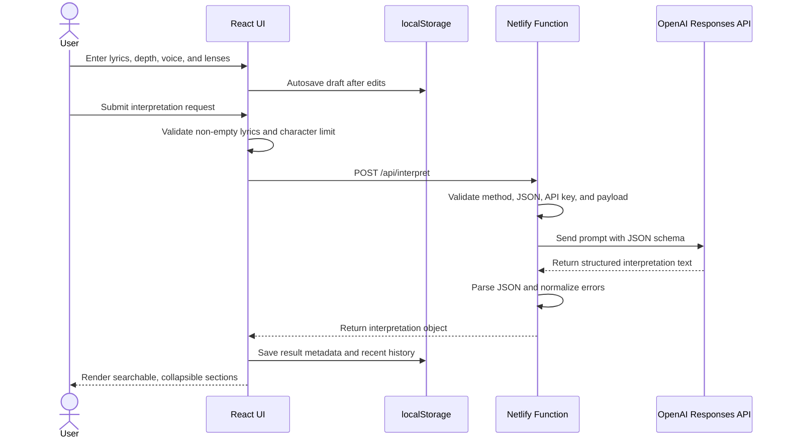
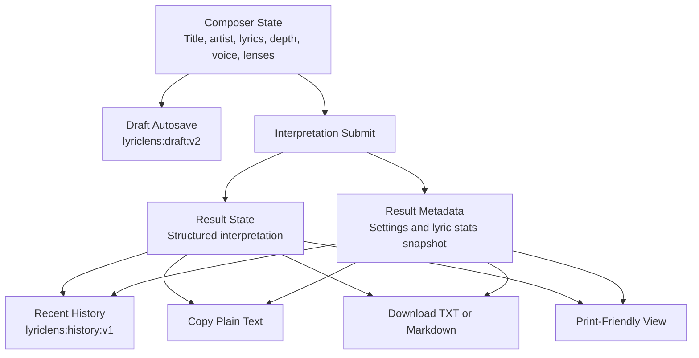

# LyricLens Project Documentation

## Overview

LyricLens is a web-based music interpretation assistant built for Netlify. A user can paste lyrics, optionally provide the song title and artist, choose the desired explanation depth, and receive a structured plain-English interpretation.

The application is designed around the requested output sections:

1. Overall meaning
2. Background context
3. Verse-by-verse explanation
4. Slang and phrases
5. References
6. Ambiguous lines
7. Final takeaway

The model instructions intentionally avoid long lyric quotations, unsupported claims, and invented context. When a reference is uncertain, the response schema gives the assistant a place to mark that uncertainty.

The app also keeps the user workflow local-first: drafts and recent interpretations are saved in browser storage, exports are generated client-side, and the API key remains isolated in the Netlify Function.

## Application Architecture

LyricLens has two main parts:

| Area | Path | Purpose |
| --- | --- | --- |
| React frontend | `src/main.jsx` | Renders the lyric input workflow, output sections, copy/download actions, and loading/error states. |
| Styling | `src/styles.css` | Defines the responsive interface, color system, layout, controls, and result section styling. |
| Static artwork | `public/lyriclens-studio.png` | Local visual asset used by the app so deployment does not depend on remote image hosting. |
| Netlify function | `netlify/functions/interpret.mjs` | Server-side API route that calls OpenAI without exposing the API key in the browser. |
| Netlify config | `netlify.toml` | Defines build output, functions directory, and `/api/*` redirect behavior. |
| Vite config | `vite.config.js` | Enables the React plugin for the Vite build. |

The browser calls `/api/interpret`. Netlify rewrites that route to `/.netlify/functions/interpret`, where the serverless function validates input, calls the OpenAI Responses API, parses the structured JSON result, and returns it to the frontend.

### Runtime Component Diagram



### Request Sequence Diagram



### Client State And Export Flow



## Key Features

- Structured lyric interpretation with seven fixed sections.
- Optional song title and artist fields for extra context.
- Explanation depth selector with `Plain`, `Deep`, and `Cautious` modes.
- Response voice selector with neutral, literary, direct, and classroom modes.
- Interpretation lens selector for themes, craft, context, and ambiguity.
- Built-in original demo lyric for quick app testing.
- Lyric formatting cleanup plus word, line, and character stats.
- Autosaved local drafts.
- Recent interpretation history with one-click restore and removal.
- Result metadata snapshots for title, artist, depth, voice, lenses, and lyric stats.
- Clear-all recent history action.
- Search, jump controls, collapsible sections, and expand/collapse-all actions for long interpretations.
- Text file upload for `.txt`, `.md`, and `.text` files.
- Copy plus `.txt`, `.md`, and structured `.json` download actions for the generated interpretation.
- Print-friendly result view for paper or browser PDF output.
- Responsive desktop and mobile layout.
- Server-side API key handling through Netlify Functions.
- JSON Schema structured output to keep frontend rendering predictable.
- Clear setup error if `OPENAI_API_KEY` is missing.
- Configurable OpenAI request timeout with a clear timeout response.

## Environment Variables

| Variable | Required | Default | Description |
| --- | --- | --- | --- |
| `OPENAI_API_KEY` | Yes | None | OpenAI API key used by the Netlify Function. Never expose this in frontend code. |
| `OPENAI_MODEL` | No | `gpt-5.5` | Model slug used by the interpretation function. |
| `OPENAI_TIMEOUT_MS` | No | `45000` | Maximum OpenAI request time in milliseconds. Values are clamped from 5,000 to 120,000. |

For local development, copy `.env.example` to `.env` and add your key.

## Local Development

Install dependencies:

```bash
npm install
```

Start the Vite-only frontend:

```bash
npm run dev
```

Use this when you are only changing the UI. The OpenAI-backed function route is not handled by plain Vite.

Start the Netlify development server:

```bash
npm run dev:netlify
```

Use this when you want the frontend and Netlify Function to run together locally. This command uses `npx netlify dev`, so it may ask to install or download Netlify CLI if it is not already available.

Build the production app:

```bash
npm run build
```

Preview the built app:

```bash
npm run preview
```

## Netlify Deployment

1. Push the repository to GitHub.
2. In Netlify, create a new site from the GitHub repository.
3. Use these build settings:

| Setting | Value |
| --- | --- |
| Build command | `npm run build` |
| Publish directory | `dist` |
| Functions directory | `netlify/functions` |

4. Add `OPENAI_API_KEY` in Netlify site environment variables.
5. Optionally add `OPENAI_MODEL` if you want to override the default model.
6. Deploy the site.

The `netlify.toml` file already contains the build and function configuration, so Netlify should detect most settings automatically.

## API Flow

1. The user submits the form in the React app.
2. The frontend sends a `POST` request to `/api/interpret`.
3. Netlify redirects `/api/interpret` to the serverless function.
4. The function validates:
   - HTTP method
   - JSON body
   - required `lyrics`
   - maximum lyric length
   - selected response voice and interpretation lenses
   - presence of `OPENAI_API_KEY`
5. The function sends the prompt, depth, response voice, and selected lenses to OpenAI with a JSON Schema response format.
6. The function parses the model output and returns:

```json
{
  "interpretation": {
    "overallMeaning": "...",
    "backgroundContext": "...",
    "verseByVerse": [],
    "slangAndPhrases": [],
    "references": [],
    "ambiguousLines": [],
    "finalTakeaway": "..."
  }
}
```

## Prompting And Safety Rules

The server prompt tells the assistant to:

- Explain lyrics in plain English.
- Avoid quoting long lyric sections.
- Avoid inventing facts.
- Mark uncertain references as uncertain.
- Explain slang, cultural references, double meanings, artist context, tone, and likely intent.
- Follow the selected response voice while keeping claims grounded.
- Prioritize the selected interpretation lenses while still filling all sections.
- Use short hints rather than long lyric quotations when discussing specific lines.

The structured schema also includes certainty labels for references:

- `likely`
- `uncertain`
- `not enough context`

## Frontend Behavior

The frontend keeps the user workflow simple:

- Empty lyrics disable the submit button.
- Demo lyrics can populate the composer without uploading a file.
- The response voice selector changes the explanation style sent to the API.
- Lyric stats update as the user types.
- A character-limit meter mirrors the server-side 24,000-character maximum and disables submission when exceeded.
- The cleanup action normalizes line endings, trims trailing whitespace, and collapses excessive blank lines.
- Drafts autosave to `localStorage` and are restored on the next visit.
- Loading state shows while the function is running.
- Errors are shown inline in a visible alert.
- Successful results render as separate sections.
- Completed results show the saved interpretation settings used for that run.
- Recent results are saved locally and can be restored from the output panel.
- Recent history can be cleared from the output panel.
- Result search filters sections and highlights the first match in each field.
- Section number buttons jump to the matching output section.
- Section headers collapse or expand long explanations, with bulk expand and collapse controls.
- Copy exports all sections as plain text with result metadata.
- Download saves `.txt`, `.md`, or `.json` files named from the saved song or artist fields when available.
- Print opens the browser print flow with composer controls hidden.
- Keyboard shortcuts: `Ctrl`/`Cmd` + `Enter` submits, and `Ctrl`/`Cmd` + `S` saves a draft.

## Troubleshooting

### The app builds but interpretation fails

Check that `OPENAI_API_KEY` is configured in Netlify or in your local `.env` file.

### The browser shows a 404 for `/api/interpret`

Run with Netlify Dev locally:

```bash
npm run dev:netlify
```

Plain `npm run dev` only starts Vite and does not run Netlify Functions.

### Netlify deploy does not call the function

Confirm that `netlify.toml` is present in the repository and contains:

```toml
[[redirects]]
  from = "/api/*"
  to = "/.netlify/functions/:splat"
  status = 200
```

### The model response is malformed

The app uses Structured Outputs with a JSON Schema, which should keep the shape stable. If errors occur, inspect the Netlify Function logs for the OpenAI error message returned by `netlify/functions/interpret.mjs`.

### Interpretation times out

Try a shorter excerpt, choose a lower detail setting, or increase `OPENAI_TIMEOUT_MS` in Netlify within the supported 5,000 to 120,000 millisecond range.

## Verification Checklist

Before deployment or after major changes:

```bash
npm run build
npm audit
node --check netlify/functions/interpret.mjs
```

Also test at least one desktop and one mobile viewport for:

- No horizontal scrolling.
- Image asset loads.
- Submit button is disabled when lyrics are empty.
- Lens checkboxes keep at least one selected.
- Drafts and recent history persist after refresh.
- Errors render clearly.
- Result sections are readable after a successful interpretation.
- Search, collapse, jump, and export actions work on a completed result.
- Print preview contains only the interpretation content and metadata.

## Repository Hygiene

The repository intentionally ignores generated and local-only files:

- `node_modules/`
- `dist/`
- `.netlify/`
- `.env`
- local logs and OS metadata

Commit source files, documentation, package manifests, Netlify configuration, and static assets needed by the app.
