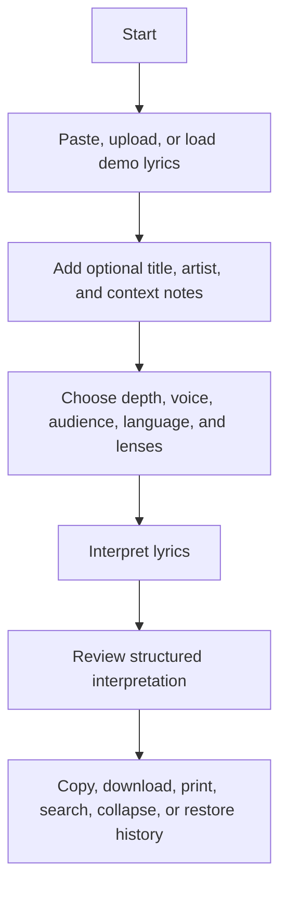

# LyricLens User Manual

LyricLens helps you turn pasted song lyrics into a structured interpretation. It is designed for listeners, students, songwriters, and reviewers who want a grounded explanation without long lyric quotations or invented context.

Use this manual when you want to operate the app. For deployment, architecture, API, and maintenance details, see [PROJECT_DOCUMENTATION.md](PROJECT_DOCUMENTATION.md).

## Quick Start

1. Open LyricLens in your browser.
2. Paste lyrics into the `Lyrics` field, or use the demo or upload controls.
3. Optionally enter the song title, artist, and context notes.
4. Choose preset, depth, voice, audience, output language, and interpretation lenses.
5. Select `Interpret`.
6. Read, search, copy, download, print, or save the interpretation from the output panel.

## Workflow Overview



## Main Screen

LyricLens has two primary areas:

| Area | What It Does |
| --- | --- |
| Composer | Where you enter lyrics, add context, choose interpretation settings, manage drafts, and submit requests. |
| Output | Where completed interpretations, recent history, search tools, exports, copy actions, and print controls appear. |

## Composer Guide

### Lyric Stats

The stat strip updates as you type:

| Stat | Meaning |
| --- | --- |
| Words | Number of detected lyric words. |
| Lines | Number of non-empty lyric lines. |
| Sections | Number of bracketed lyric headers such as `[Verse]` or `[Chorus]`. |
| Read | Estimated reading time for the pasted lyrics. |
| Draft | Current draft state: `Unsaved`, a saved time, or `Private`. |

### Song Fields

Use `Song Title` and `Artist` when known. These fields help exports, history entries, filenames, and result metadata stay organized.

### Context Notes

Use `Context Notes` for album information, genre, release context, performance details, classroom prompt requirements, or personal context. Notes are sent with the request but are kept separate from the lyrics.

Good context notes are short and factual:

```text
Acoustic folk track from a breakup album. User is studying imagery and unreliable narration.
```

### Presets

Presets update several interpretation settings together:

| Preset | Best For |
| --- | --- |
| Balanced | General meaning and context. |
| Close Read | Imagery, craft, ambiguity, and deeper interpretation. |
| Classroom | Teacherly explanations with clearer reasoning. |
| Cautious | Evidence-focused interpretation with more uncertainty handling. |

You can still adjust individual settings after choosing a preset.

### Depth

| Depth | Use When |
| --- | --- |
| Plain | You want a clear, compact explanation. |
| Deep | You want more detail and closer reading. |
| Cautious | You want the app to avoid overclaiming when context is limited. |

### Voice

| Voice | Effect |
| --- | --- |
| Neutral | Balanced explanation style. |
| Literary | More attention to symbolism, imagery, and craft. |
| Direct | Concise and practical language. |
| Classroom | More explicit definitions and reasoning. |

### Audience

| Audience | Effect |
| --- | --- |
| Listener | Explains the core meaning and emotional stakes. |
| Student | Adds clearer examples and educational framing. |
| Songwriter | Emphasizes craft, structure, and revision-aware observations. |
| Critic | Prioritizes evidence, uncertainty, and alternate readings. |

### Output Language

Choose the language for the generated interpretation:

- English
- Spanish
- French
- German
- Urdu

The lyric text itself can still be pasted in any language, but the structured explanation is requested in the selected output language.

### Lenses

Lenses tell LyricLens what to emphasize:

| Lens | Emphasis |
| --- | --- |
| Themes | Story, emotion, speaker motivation, and overall meaning. |
| Craft | Imagery, metaphor, rhyme, repetition, and structure. |
| Context | Genre, cultural references, and artist or release context when supported. |
| Ambiguity | Alternate readings, uncertainty, and places where evidence is limited. |

At least one lens must stay selected.

### Lyrics Box

Paste lyrics into the main `Lyrics` box. Use section headers to improve verse-by-verse output:

```text
[Verse 1]
...

[Chorus]
...

[Bridge]
...
```

The quick section buttons insert common headers:

- Verse
- Chorus
- Bridge

### Lyric Quality Hints

LyricLens provides local hints before you submit. These hints can point out:

- Missing bracketed section headers.
- Very short excerpts.
- Lines longer than 120 characters.
- High repetition.
- Drafts that look ready for interpretation.

These hints are computed in the browser and do not require an API request.

### Character Limit

The lyric character meter tracks the 24,000-character limit. If the lyrics exceed the limit, the submit button is disabled until the text is shortened.

## Composer Actions

| Button | Action |
| --- | --- |
| Demo | Loads the built-in demo lyric. |
| Upload | Imports a `.txt`, `.md`, or `.text` file into the lyrics box. |
| Clean | Normalizes line endings, trims trailing whitespace, and collapses excessive blank lines. |
| Private | Toggles private mode. |
| Copy Draft | Copies the current lyric workspace as plain text. |
| Download Draft | Downloads the current lyric workspace as a `.txt` file. |
| Save Draft | Manually saves the current draft, unless private mode is enabled. |
| Clear | Clears composer fields, output, errors, and the saved draft. |
| Interpret | Submits the lyrics for interpretation. |

## Drafts

Drafts save automatically in browser storage when private mode is off. A draft can include:

- Title
- Artist
- Context notes
- Depth
- Voice
- Audience
- Output language
- Lenses
- Lyric stats
- Lyrics

Use copy or download draft actions when you want a portable snapshot before submitting.

## Private Mode

Private mode is for temporary or sensitive work. When private mode is enabled:

- The current autosaved draft is removed.
- New draft autosaves are paused.
- Completed interpretations are not added to recent history.
- Manual draft saving is disabled.

Private mode does not prevent the current interpretation request from being sent to the configured Netlify Function and OpenAI API. It only changes local browser storage behavior.

## Output Guide

After a successful request, LyricLens returns seven sections:

1. Overall meaning
2. Background context
3. Verse-by-verse explanation
4. Slang and phrases
5. References
6. Ambiguous lines
7. Final takeaway

The output panel also shows metadata for the completed result, including title, artist, depth, voice, audience, output language, selected lenses, word count, and section count.

## Output Actions

| Button | Action |
| --- | --- |
| Copy | Copies the full interpretation as plain text. |
| Download TXT | Downloads the interpretation as a `.txt` file. |
| Download Markdown | Downloads the interpretation as a `.md` file. |
| Download JSON | Downloads metadata and structured interpretation data as `.json`. |
| Print | Opens the browser print flow with composer controls hidden. |
| Expand All | Opens all interpretation sections. |
| Collapse All | Collapses all interpretation sections. |
| Section Numbers | Jumps to a specific interpretation section. |
| Section Copy | Copies one interpretation section at a time. |

## Search Results

Use `Search sections` to filter the completed interpretation. The match count shows how many of the seven sections currently match. Select the clear button in the search field to reset the search.

Search highlights the first match inside each visible field.

## Recent History

Recent interpretations are saved locally when private mode is off.

History features include:

- Restore a previous interpretation.
- Search history.
- Filter between all entries and pinned entries.
- Pin important entries.
- Remove one entry.
- Clear unpinned entries.
- Export history as JSON.
- Import a LyricLens history JSON file.

Pinned entries stay above regular recent entries and survive the clear-unpinned action.

## Import And Export

### Import Lyrics

Use the upload button to import:

- `.txt`
- `.md`
- `.text`

The filename is used as the title if the title field is empty.

### Export Interpretation

Use the output toolbar to export:

| Format | Best For |
| --- | --- |
| TXT | Notes, chat, or plain text archives. |
| Markdown | Documentation, study notes, or GitHub-friendly writing. |
| JSON | Structured backup, tooling, or future processing. |

### Export History

History export creates `lyriclens-history.json`, including an export timestamp and saved entries.

## Keyboard Shortcuts

| Shortcut | Action |
| --- | --- |
| `Ctrl` + `Enter` | Submit the current interpretation request. |
| `Cmd` + `Enter` | Submit the current interpretation request on macOS. |
| `Ctrl` + `S` | Save the current draft. |
| `Cmd` + `S` | Save the current draft on macOS. |

## Local Data And Privacy

LyricLens stores local browser data under these keys:

| Storage Key | Purpose |
| --- | --- |
| `lyriclens:draft:v2` | Autosaved draft workspace. |
| `lyriclens:history:v1` | Recent interpretation history. |
| `lyriclens:preferences:v1` | Preferences such as private mode. |

The OpenAI API key is never stored in frontend code. It is read only by the Netlify Function from environment variables.

## Troubleshooting

### The Interpret Button Is Disabled

Check whether:

- The lyrics box is empty.
- The lyrics exceed 24,000 characters.
- A request is already loading.

### Interpretation Fails

Try these steps:

- Shorten the lyric excerpt.
- Use `Plain` depth instead of `Deep`.
- Confirm the site administrator configured `OPENAI_API_KEY`.
- Try again after a temporary network or API issue.

### The Verse-by-Verse Section Is Too General

Add bracketed headers such as `[Verse 1]`, `[Chorus]`, or `[Bridge]` before submitting.

### History Is Not Saving

Check whether private mode is enabled. Private mode skips new history saves.

### Draft Is Not Saving

Check whether private mode is enabled. Private mode removes the saved draft and pauses autosave.

### Imported History Does Not Appear

Make sure the file is valid LyricLens JSON exported from the history toolbar. Invalid or empty files are rejected.

## Best Practices

- Add short context notes instead of pasting background research into the lyrics box.
- Use `Cautious` depth when working with obscure songs or incomplete excerpts.
- Use the `Craft` lens for songwriting feedback.
- Use the `Ambiguity` lens when a lyric has multiple possible meanings.
- Pin important interpretations before clearing recent history.
- Export history before changing browsers or clearing site data.
